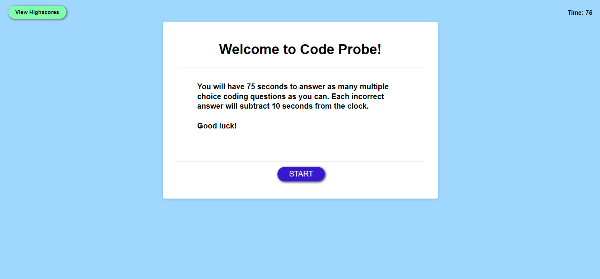
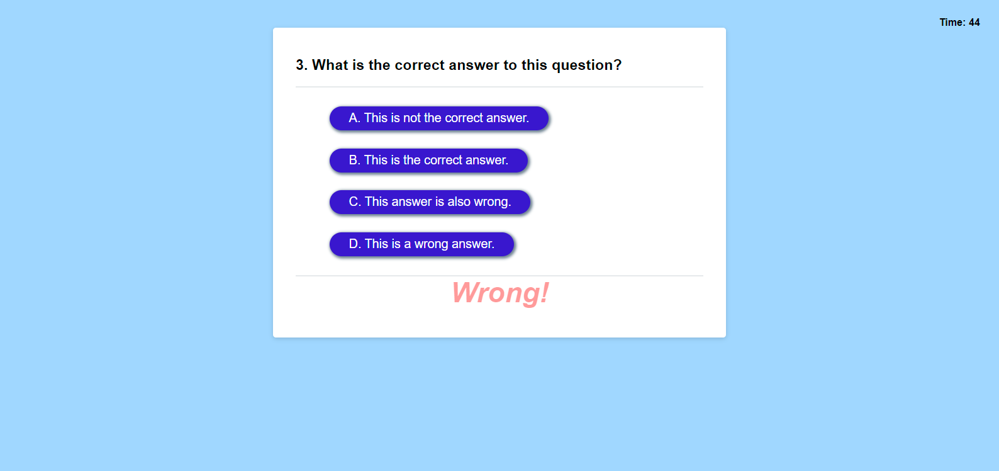
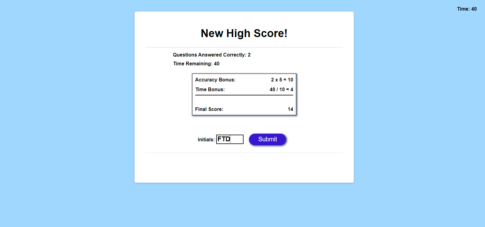
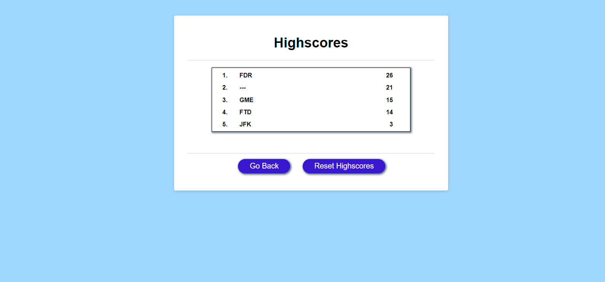

# code-probe

Test your knowledge of Javacsript, CSS, HTML, and more! Upon starting the quiz, a timer counts down from 75 seconds and the user is prompted with several multiple-choice questions. (Questions and their answer choices appear in a randomized order each time the quiz is taken.)

Each correct answer will increase the final score, while incorrect answers will subtract time from the clock. A time bonus is added to the final score if the user has remaining time at the end of the quiz. The calculation for the user's final score is

Final Score = (Number of correct answers * 5) + (Time Remaining / 10)

The user is prompted to enter their initials and their score is saved locally to a list of high scores.

## Usage

Access the deployed site at [https://chardmuffin.github.io/code-probe/](https://chardmuffin.github.io/code-probe/)

Click the "START" button to begin the test or click "View Highscores" to see the list of local high scores. When the quiz starts, read the prompt and select the correct response from four possible answers. When all questions are answered or the time runs out, the user will see the calculation for their final score. The user can type 3 characters and click the "Submit" button to save their score. The user will see their score in the list of code-probe high scores.






### Adding/Changing Questions, Adjusting Difficulty

Edit the array of objects "questionArray" in welcomeMessage() so that each object contains a "prompt" and "answers" where:
* "prompt" is a String containing the question in quotes.
* "answers" is an Array containing 4 Strings where the first index of the array is the correct answer.

e.g:
```javascript
questionArray = [
    {
        "prompt" : "Enter the String prompt here",
        "answers" :
            ["Correct",
            "Wrong",
            "Also Wrong",
            "Incorrect"]
    },
    {
        "prompt" : "What is the correct answer to this question?",
        "answers" :
            ["This is the correct answer.",
            "This is a wrong answer.",
            "This answer is also wrong.",
            "This is not the correct answer."]
    },
    ...

    ...
    ]
```

The prompt and correct answer to the second question (index 1) in the above example can be targeted with:
```javascript
> questionArray[1].prompt;
"What is the correct answer to this question?"
> questionArray[1].answers[0];
"This is the correct answer."
```

Adjust the amount of time subtracted from wrong answers by changing the global variable:
``` javascript
var timePenalty = 10;
```

Adjust the total time allotted for the quiz by editing the variable in welcomeMessage():
``` javascript
timeLeft = 75;
```

## Acknowledgements & Comments

A version of the Fischer-Yates shuffle algorithm was used to shuffle the order of the prompts, as well as the order of the choices in each prompt. Information about the algorithm used:

[Durstenfeld shuffle algorithm](https://en.wikipedia.org/wiki/Fisher%E2%80%93Yates_shuffle#The_modern_algorithm)
```
-- To shuffle an array a of n elements (indices 0..n-1):
for i from n−1 downto 1 do
     j ← random integer such that 0 ≤ j ≤ i
     exchange a[j] and a[i]
```
Javascript implementation of the array from [Stack Overflow](https://stackoverflow.com/questions/2450954/how-to-randomize-shuffle-a-javascript-array)

### Implementation of nextQuestionHandler()

The most difficult part of this project was in developing the function nextQuestionHandler(). This function is called each time a new question is displayed on the screen (every time the user makes a selection). It is also called to display the first question. The desired functionality was to display the "Wrong!" and "Correct!" message without taking up any of the user's time during the quiz, meaning the next question would be dispayed while the "Wrong!" and "Correct!" message refers to the previous selection.

* The function increments the global variable currQuestion, which is used to track the index of the current question from the shuffled array of questions.

* The function needed to end if there were no more questions in questionArray.

* Because the shuffle() function changes the order of the "answer" Strings for each questionArray[currQuestion], the correct answer needs to be stored as a String prior to shuffling the answers. After the choices are shuffled, the new element ID of the button containing the correct answer is stored in correctAnswerId while the answers are loaded into the 4 buttons.

* It became necessary to create a global variable correctAnswerId. The function ends once the Id is stored of the correct answer to what will become the previous question during the next call to nextQuestionHandler(). The comparison of the user's selection (event.target.id) to correctAnswerId is performed at the beginning of each call to nextQuestionHandler().

* event.target would be null if this was the first question in the quiz. That is handled by wrapping the correct/wrong comparison logic in an "if(event) {...}" statement.

* The "Wrong!" and "Correct!" message appear and fade via transition by changing the class name of the element and using a different style.

* Correct answers increment the user's score, while incorrect answers subtract the value in timePenalty from the remaining quiz time.


## License

[MIT](https://choosealicense.com/licenses/mit/)
